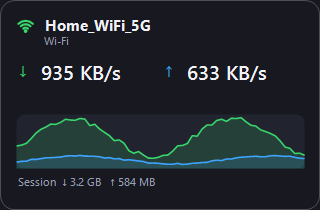
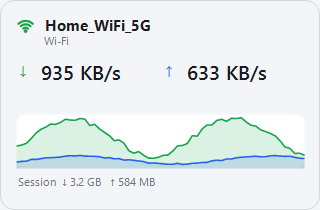
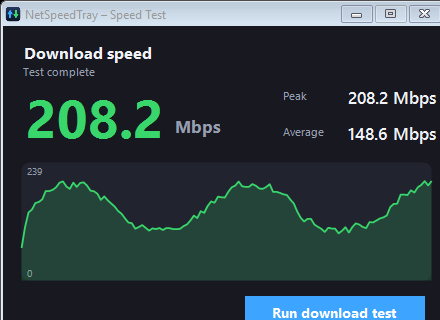

# NetSpeedTray

A tiny (~45 KB) Windows **system-tray internet speed monitor**. It draws your live
download/upload speed right on the tray icon — like the Wi-Fi icon — and opens an
elegant popup with your network name, a live graph, and an Mbps speed test.

Standalone `.exe`. **No installer, no runtime download** — it runs on Windows 10 & 11
out of the box (uses the .NET Framework already built into Windows).

<p align="center">
  
  &nbsp;&nbsp;
  
</p>

## Features

| | |
|---|---|
| 📊 **Live speed on the tray icon** | Download (green) over upload (blue), updated every second — visible at a glance like the Wi-Fi icon. |
| 🖱️ **Elegant popup** | Left-click the tray icon for big readouts, the **network name**, a live sparkline, and session totals. |
| 📶 **Wi-Fi *and* Ethernet** | Automatically follows whichever adapter carries your internet. Shows a **Wi-Fi glyph + SSID** on wireless, or an **Ethernet glyph + adapter name** when wired. |
| ⚡ **Mbps speed test** | Built-in download test (Cloudflare endpoint) with live Mbps, **peak** and **average** — great for checking your internet plan. |
| 🎛️ **Configurable units** | Auto (bytes), Auto (bits), KB/s, MB/s, Kbps, Mbps. |
| 🌙 **Dark / Light themes** | One-click toggle; your choice is remembered. |
| 🚀 **Run at startup** | Optional — launches with Windows. |
| 🪶 **Lightweight** | ~45 KB exe, a few MB of RAM, negligible CPU. |

<p align="center">
  
</p>

## Download & run

1. Grab **`NetSpeedTray.exe`** (from this repo or the Releases page).
2. Double-click it. The icon appears in the system tray — click the `^` overflow
   arrow if it's hidden, and drag it onto the taskbar to keep it visible.
3. **Left-click** the icon → popup. **Right-click** → menu (units, theme, speed test,
   run at startup, exit).

> The exe is unsigned, so SmartScreen may warn on first launch
> (**More info → Run anyway**). This is normal for self-built apps.

## Build from source

No SDK needed — it compiles with the C# compiler already included in Windows:

```bat
build.bat
```

That runs the .NET Framework `csc.exe` to produce `NetSpeedTray.exe`. Edit
`Program.cs` and re-run to rebuild.

## How it works

- Reads cumulative byte counters from the active network interface
  (`NetworkInterface.GetIPv4Statistics`) once per second and computes the delta.
- Gets the Wi-Fi SSID via `netsh wlan show interfaces`; uses the adapter name for
  Ethernet.
- Renders the tray icon on the fly with GDI+ (two auto-fitted lines, colour-coded).
- Settings are saved to `%APPDATA%\NetSpeedTray\config.ini`.

## License

MIT — do whatever you like.
